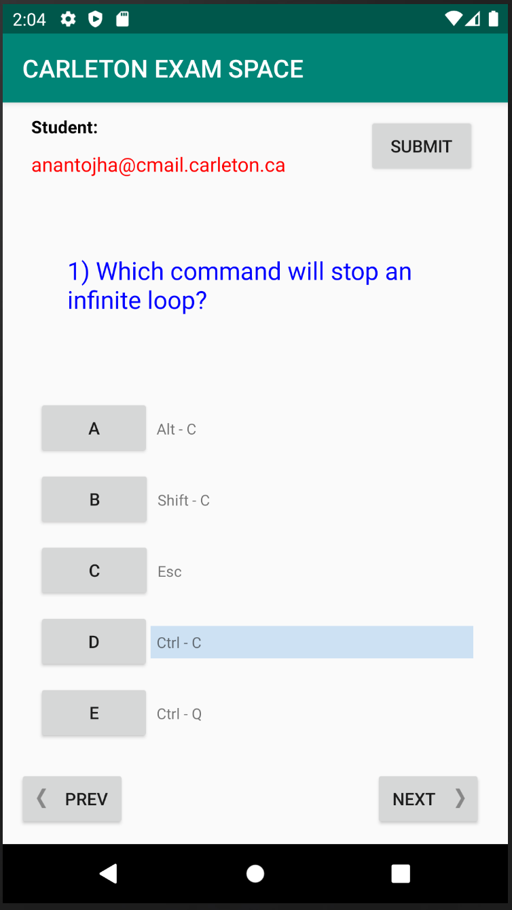
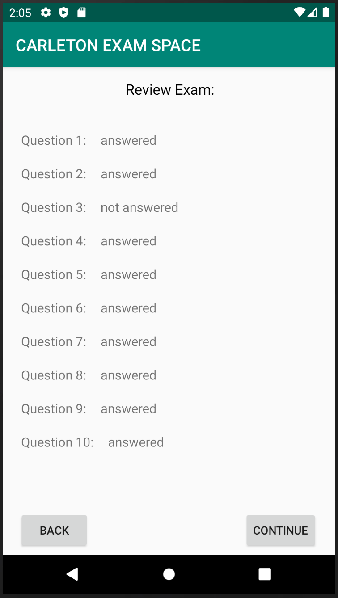
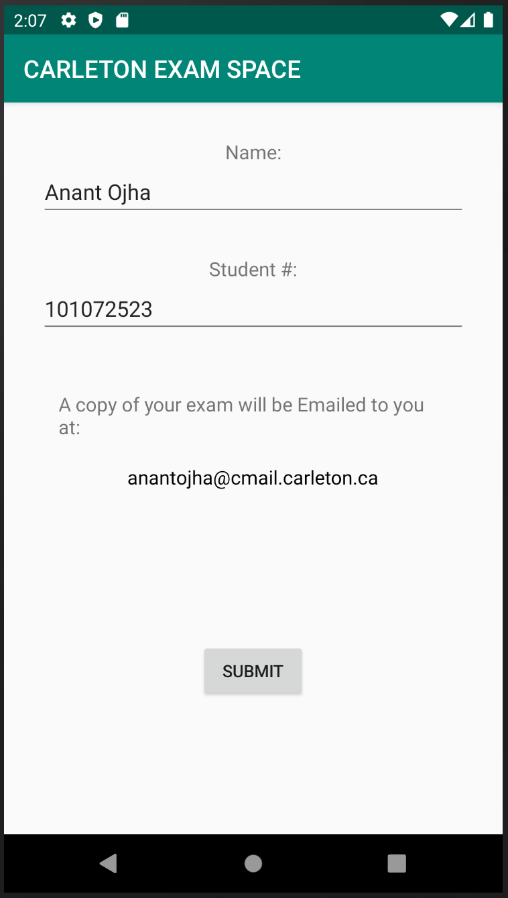
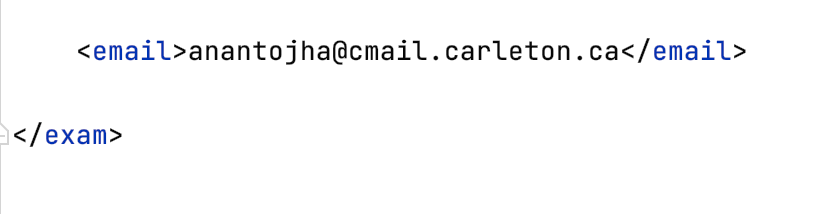
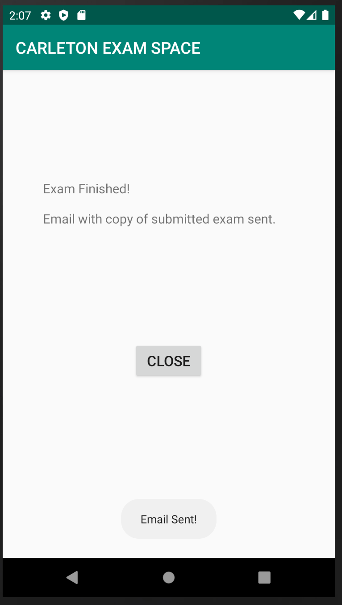
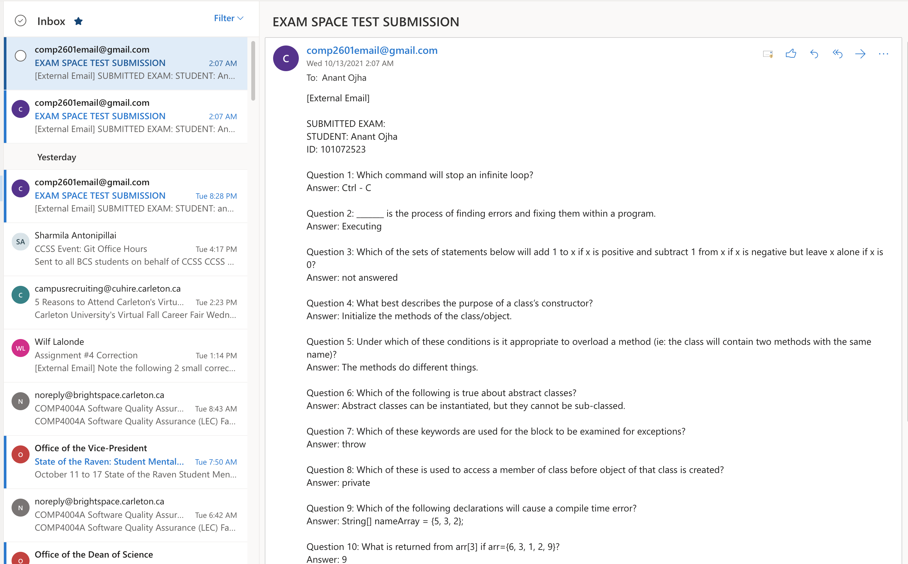

# Android Exam App

COMP2601 - Mobile Applications

Android App which lets students take Exams. 

Usage Instructions:   
Answering Exam Questions:   
     
- Select Answers:  **A  B  C  D  E**  by clicking Multiple choice buttons.
- Navigate to **Next/Preview** questions using arrow buttons.
- Click **Submit Button** to Review saved answers.   

Review Exam Answers:   
      
- Review Answers: **answered** & **not answered** 
- Click **Back Button** to go back to questions
- Click **Continue** to proceed with Exam Submission.  

Submit Exam:   
       
- Submit Exam: Provide **Student Name** & **Student #**    
- Verify E-mail address to which a copy of the exam will be sent to. (E-mail from exam.xml file)    
</img>    
- Click **Submit** to make final Exam Submission    

Confirmation:    
   
- Confirmation Message is displayed after final submission is made 
- Click **Close Button** to exit the App   
   
   
Received Email:    
   
- Email received by student after they submit an Exam
- Email content contains, **Student Name, Student #, Exam Questions and Student's Answers** 

